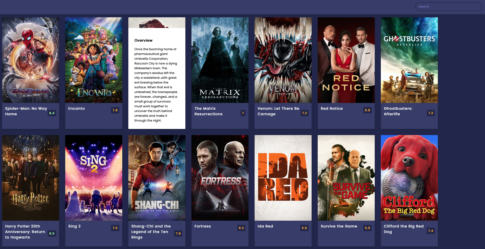

# Movie App

This is an app to choose a movie to watch.
The goal of this project is to train to use an API.

## Installing / Getting started

There is no need for a special installation here. You just need to create an account on the site https://www.themoviedb.org to in order to be able to obtain an API key.

## Developing

### Built With

HTML, CSS, JAVASCRIPT all in vanilla mode + use of the site API https://www.themoviedb.org

### Prerequisites

You just need to create an account on the site https://www.themoviedb.org to in order to be able to obtain an API key.

### Setting up Dev

I just use a local server to develop this app.

## Api Reference

The API comes from the site https://www.themoviedb.org.
You must have an account to obtain your API key.
Here the documentation about this API https://developers.themoviedb.org/3/getting-started/introduction
